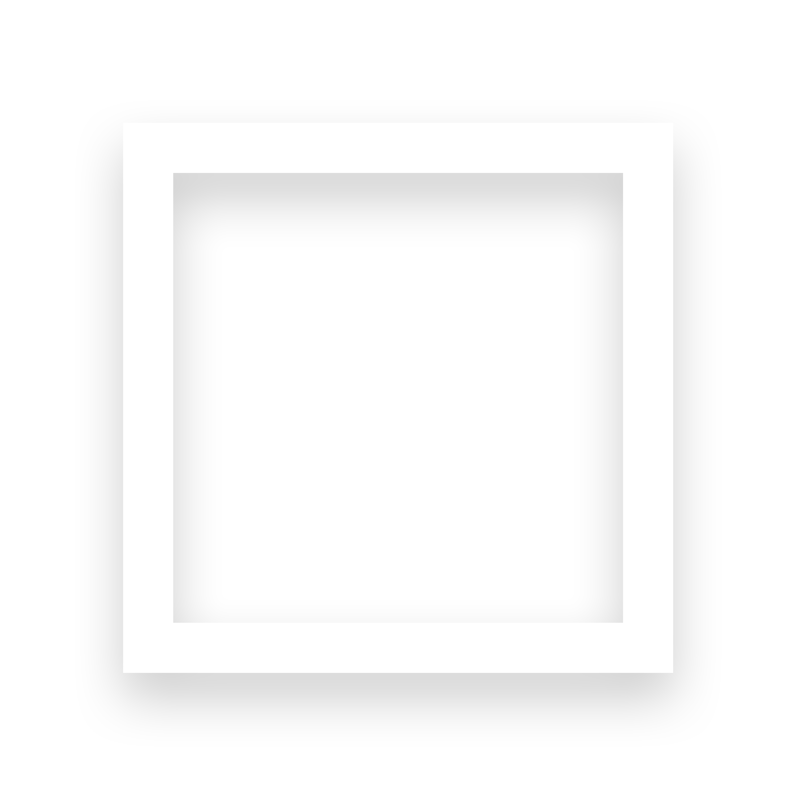

</img>

<table align="right">
 <tr><td><a href="README.md"> English</a></td></tr>
 <tr><td><a href="alt_readme/README_ID.md"> Bahasa Indonesia</a></td></tr>
 <tr><td><a href="alt_readme/README_CN.md"> 中文</a></td></tr>
 <tr><td><a href="alt_readme/README_FR.md"> Français</a></td></tr>
</table>

<h1> 🙋‍♂️ Hi there, you can call me Jason! </h1>
I'm a data scientist and aspiring indie game developer hailing all the way from tropical Indonesia. This means I'm a professional aircon enjoyer, and small-time food critique. I spend a lot of my free time cooking dishes from various cuisines, building up pixel art experience and being competitively delusional.
  
Despite my profile picture making me look like I run three MLMs in my sleep, I do enjoy talking to people and making new friends :) Most of my information and links can be found through my <a href="https://linktr.ee/jasonmatthewsuhari">LinkTree</a>, but some of my projects are down below.

---

<h1> 😎 Check these out. </h1>
These are some of the projects and blog posts I've worked on in the past. AKA the late-night eureka moments that I could still remember the day after. Some of the projects here are just fun stuff, while others are actual genuine projects. 

---

<!-- 

  

 -->
