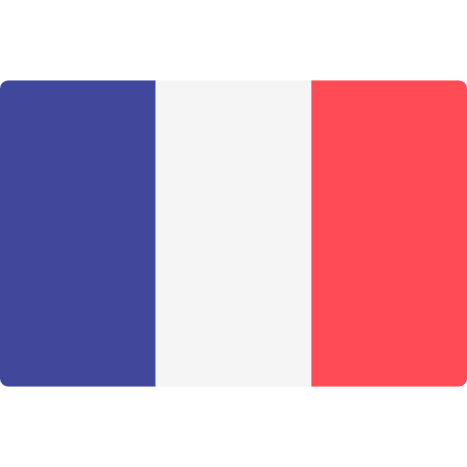
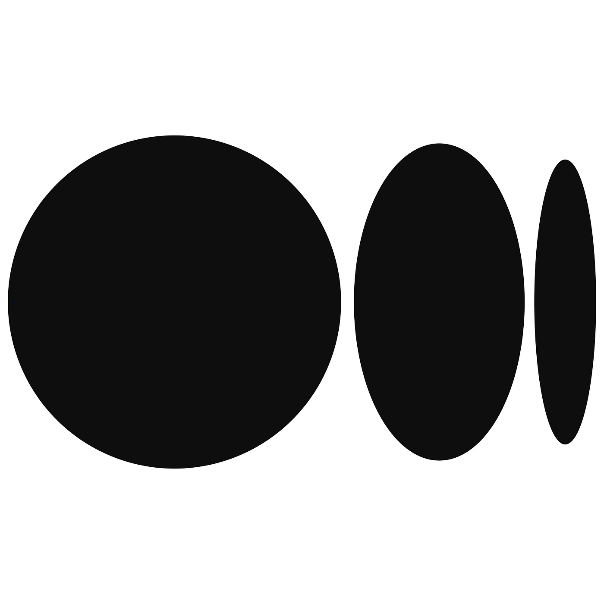
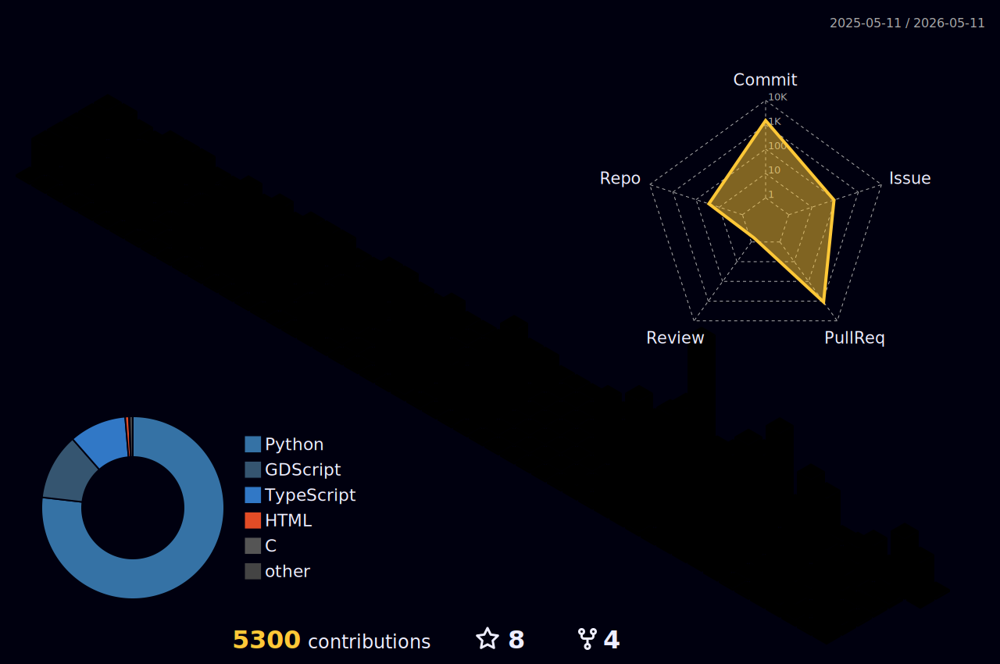

<!-- 🥚 EASTER EGG 1/7: You found the first one! There are 6 more hidden in this README. Good luck. -->


<!-- ═══════════════════════════════════════════════════════════════ -->
<!-- ░░░░░░░░░░░░░░░░░░ CAPSULE RENDER HEADER ░░░░░░░░░░░░░░░░░░░ -->
<!-- ═══════════════════════════════════════════════════════════════ -->


<table align="right">
 <tr><td><a href="README.md"> English</a></td></tr>
 <tr><td><a href="alt_readme/README_ID.md"> Bahasa Indonesia</a></td></tr>
 <tr><td><a href="alt_readme/README_CN.md"> 中文</a></td></tr>
 <tr><td><a href="alt_readme/README_FR.md"> Français</a></td></tr>
</table>

<div align="center">

<!-- ANIMATED TYPING SVG -->
<a href="https://git.io/typing-svg"></a>

<br>

<!-- PROFILE VIEWS COUNTER -->


<br>

<!-- ═══════════════════════════════════════════════════════════════ -->
<!-- ░░░░░░░░░░░░░░░░ README META-BADGES ░░░░░░░░░░░░░░░░░░░░░░░ -->
<!-- ═══════════════════════════════════════════════════════════════ -->

<!-- 🥚 EASTER EGG 2/7: This README has more badges than a Boy Scout troop leader. -->


</div>

<br>

<!-- ═══════════════════════════════════════════════════════════════ -->
<!-- ░░░░░░░░░░░░░░░░░░░░░ ABOUT ME SECTION ░░░░░░░░░░░░░░░░░░░░ -->
<!-- ═══════════════════════════════════════════════════════════════ -->

##  &nbsp;About Me

I'm a data scientist and aspiring indie game developer hailing all the way from tropical Indonesia. This means I'm a professional aircon enjoyer, and small-time food critique. I spend a lot of my free time cooking dishes from various cuisines, building up pixel art experience and writing for my blog.

Despite my profile picture making me look like I run three MLMs in my sleep, I do enjoy talking to people and making new friends :)

<table>
<tr>
<td width="50%">

```yaml
jason.yaml
---
name: Jason Matthew Suhari
location: Singapore (via Indonesia)
education: NUS Data Science & Analytics '27
readme_version: "4.2.0"
overengineered: true
system_uptime: "21 years and counting"
badges_in_this_readme: "yes"
roles:
  - Data Scientist
  - Indie Game Developer
  - Pixel Artist
  - Technical Writer
  - Professional README Overengineer
currently_building:
  - AI-powered Godot tooling
  - Kaggle competition solutions
  - Whatever hackathon is next
  - This README (it's never finished)
fun_facts:
  - Professional aircon enjoyer
  - Cooks dishes from 8+ cuisines
  - Chess enthusiast
  - Does NOT run three MLMs
  - Has mass GitHub Actions running for this README
```

</td>
<td width="50%">

<div align="center">

### Quick Links

[](https://jasonmatthewsuhari.github.io)

[](https://medium.com/@jasonmatthewsuhari)

[](https://www.linkedin.com/in/jason-matthew-suhari-780664213/)

[](https://www.instagram.com/jasonmatthewsuhari/)

[](https://x.com/jasonmatthews_)

[](https://linktr.ee/jasonmatthewsuhari)

</div>

</td>
</tr>
</table>

<!-- ═══════════════════════════════════════════════════════════════ -->
<!-- ░░░░░░░░░░░░░░░ SYSTEM STATUS DASHBOARD ░░░░░░░░░░░░░░░░░░░ -->
<!-- ═══════════════════════════════════════════════════════════════ -->

### `jason.exe` — System Status Dashboard

```
╔══════════════════════════════════════════════════════════════════╗
║                                                                  ║
║   jason@github ~ $ neofetch                                      ║
║                                                                  ║
║   ████████╗ ██████╗ ███████╗        OS:      Human v21.x LTS     ║
║      ██╔══╝██╔════╝ ██╔════╝        Host:    Singapore (SGP-01)  ║
║      ██║   ╚█████╗  ███████╗        Kernel:  NUS DSA '27         ║
║   ██ ██║    ╚═══██╗ ╚════██║        Uptime:  21 years            ║
║   ╚███╔╝   ██████╔╝ ███████║        Shell:   bash/zsh/fish       ║
║    ╚══╝    ╚═════╝  ╚══════╝        DE:      VS Code + Godot     ║
║                                      WM:      i3 (pretends to)   ║
║   CPU:     Caffeine-Cooled i7        Terminal: Windows Terminal   ║
║   GPU:     Imagination RTX 4090      Packages: mass npm, pip     ║
║   RAM:     8GB (7.9GB used by       Resolution: 1920x1080       ║
║            Chrome tabs)              Theme:   Gruvbox [Dark]      ║
║   Disk:    99% memes, 1% code       Font:    Fira Code Nerd      ║
║                                                                  ║
╚══════════════════════════════════════════════════════════════════╝
```

<div align="center">


</div>

<!-- ═══════════════════════════════════════════════════════════════ -->
<!-- ░░░░░░░░░░░░░░░░░░░░░ NOW PAGE ░░░░░░░░░░░░░░░░░░░░░░░░░░░ -->
<!-- ═══════════════════════════════════════════════════════════════ -->

<!-- 🥚 EASTER EGG 3/7: The "Now" page concept was invented by Derek Sivers. Now you know. -->

### What I'm Up To Right Now

> *Last updated: March 2026*

- Building AI-powered game development tools with Godot + MCP
- Competing in Kaggle competitions (currently: getting humbled by grandmasters)
- Writing articles on Medium about data science and tech
- Attending every hackathon within a 50km radius
- Overengineering this README instead of doing actual work


<!-- ═══════════════════════════════════════════════════════════════ -->
<!-- ░░░░░░░░░░░░░░░░░ SKILL PROGRESS BARS ░░░░░░░░░░░░░░░░░░░░░ -->
<!-- ═══════════════════════════════════════════════════════════════ -->

##  &nbsp;Skill Progress Bars

> Because a tech stack section wasn't enough — you need to see the exact percentage.

| Skill | Proficiency | Level | Notes |
|-------|------------|-------|-------|
| Python | `████████████████████░░░` 88% | Advanced | My bread and butter |
| TypeScript | `██████████████████░░░░░` 75% | Advanced | Types are a lifestyle |
| Data Science | `███████████████████░░░░` 80% | Advanced | I have a Kaggle account to prove it |
| Machine Learning | `████████████████░░░░░░░` 68% | Intermediate | The model works... sometimes |
| Game Dev (Godot) | `██████████████░░░░░░░░░` 60% | Intermediate | My games have at least 3 bugs |
| Pixel Art | `████████████░░░░░░░░░░░` 52% | Intermediate | Squinting at tiny canvases |
| React/Next.js | `██████████████████░░░░░` 75% | Advanced | useEffect confusion: mastered |
| SQL | `█████████████████░░░░░░` 72% | Advanced | SELECT * FROM skills |
| DevOps/Docker | `██████████░░░░░░░░░░░░░` 42% | Beginner+ | It works on my machine... in a container |
| CSS | `████████░░░░░░░░░░░░░░░` 35% | Pain | `!important` is my best friend |
| README Engineering | `███████████████████████` 100% | Legendary | You're looking at the proof |
| Sleep | `██░░░░░░░░░░░░░░░░░░░░░` 8% | Critical | Send help |


<!-- ═══════════════════════════════════════════════════════════════ -->
<!-- ░░░░░░░░░░░░░░░░░░░░░ TECH STACK SECTION ░░░░░░░░░░░░░░░░░░ -->
<!-- ═══════════════════════════════════════════════════════════════ -->

##  &nbsp;Tech Arsenal

<details open>
<summary><b>Languages</b></summary>
<br>


</details>

<details open>
<summary><b>Data Science & ML</b></summary>
<br>


</details>

<details open>
<summary><b>Frameworks & Platforms</b></summary>
<br>


</details>

<details open>
<summary><b>Tools & Infrastructure</b></summary>
<br>


</details>


<!-- ═══════════════════════════════════════════════════════════════ -->
<!-- ░░░░░░░░░░░░░░░░░░░░░ PROJECTS SECTION ░░░░░░░░░░░░░░░░░░░░ -->
<!-- ═══════════════════════════════════════════════════════════════ -->

##  &nbsp;Featured Projects

> The late-night eureka moments I could still remember the day after.

<table>
<tr>

<td width="50%" valign="top">

###  godot-mcp
MCP server for AI-driven Godot game engine automation. Bridging the gap between AI agents and game development.

[](https://github.com/jasonmatthewsuhari/godot-mcp)


</td>

<td width="50%" valign="top">

###  source-awakening
Submission for the Source Awakening hackathon (2026).

[](https://github.com/jasonmatthewsuhari/source-awakening)


</td>

</tr>
<tr>

<td width="50%" valign="top">

###  cerebral-gemini-hackathon
Cerebral Valley Gemini 3 Hackathon submission. AI meets game engines.

[](https://github.com/jasonmatthewsuhari/cerebral-gemini-hackathon)


</td>

<td width="50%" valign="top">

###  sds-datathon-25
Winner's POV. First place datathon submission.

[](https://github.com/jasonmatthewsuhari/sds-datathon-25)


</td>

</tr>
<tr>

<td width="50%" valign="top">

###  kaggle
Jason's attempts at different Kaggle competitions. Learning by competing.

[](https://github.com/jasonmatthewsuhari/kaggle)


</td>

<td width="50%" valign="top">

###  Medium Blog
Thoughts on data science, tech, and life. Written with varying levels of caffeine.

[](https://medium.com/@jasonmatthewsuhari)
<br>
<a href="https://medium.com/@jasonmatthewsuhari">

</a>

</td>

</tr>
</table>

<details>
<summary><b>More Hackathon Projects (I go to a lot of these)</b></summary>
<br>

| Project | Event | Stack |
|---------|-------|-------|
| [HnR-2026-Lovelace](https://github.com/jasonmatthewsuhari/HnR-2026-Lovelace) | Hack&Roll 2026 |  |
| [HnR-2024](https://github.com/jasonmatthewsuhari/HnR-2024) | Hack&Roll 2024 |  |
| [first-visions-danta](https://github.com/jasonmatthewsuhari/first-visions-danta) | NUS Hackathon |  |
| [gemini-3-hackathon](https://github.com/jasonmatthewsuhari/gemini-3-hackathon) | Gemini Hackathon |  |
| [hacknomics](https://github.com/jasonmatthewsuhari/hacknomics) | Hacknomics |  |
| [it-hacks-25](https://github.com/jasonmatthewsuhari/it-hacks-25) | IT Hacks 2025 |  |
| [luma-startathon](https://github.com/jasonmatthewsuhari/luma-startathon) | Luma Startathon |  |
| [youth-coders-hack](https://github.com/jasonmatthewsuhari/youth-coders-hack) | Youth Coders |  |
| [maximally-hacktober](https://github.com/jasonmatthewsuhari/maximally-hacktober) | Hacktoberfest |  |
| [ntu-beyond-binary](https://github.com/jasonmatthewsuhari/ntu-beyond-binary) | NTU Beyond Binary |  |
| [BugBytes](https://github.com/jasonmatthewsuhari/BugBytes) | NUS Orbital (Artemis) | - |

</details>

<!-- ═══════════════════════════════════════════════════════════════ -->
<!-- ░░░░░░░░░░░░░░░░░ LATEST BLOG POSTS ░░░░░░░░░░░░░░░░░░░░░░ -->
<!-- ═══════════════════════════════════════════════════════════════ -->

### Latest Blog Posts

<!-- 🥚 EASTER EGG 4/7: The blog posts auto-update daily. Yes, there's a GitHub Action for that. Yes, it's overkill. -->

<!-- BLOG-POST-LIST:START -->
*Blog posts will auto-populate here via GitHub Actions. Stay tuned!*
<!-- BLOG-POST-LIST:END -->

> Powered by [blog-post-workflow](https://github.com/gautamkrishnar/blog-post-workflow)


<!-- ═══════════════════════════════════════════════════════════════ -->
<!-- ░░░░░░░░░░░░░░░░ SPOTIFY + CHESS + GUESTBOOK ░░░░░░░░░░░░░░ -->
<!-- ═══════════════════════════════════════════════════════════════ -->

##  &nbsp;Vibes & Interactives

### Now Playing on Spotify

> *Setup required: Deploy [novatorem](https://github.com/novatorem/novatorem) to Vercel and link your Spotify account.*

<!-- Replace YOUR_VERCEL_DOMAIN with your actual deployment URL -->
<!--  -->


*When this is set up, you'll see what I'm listening to in real-time. Spoiler: it's lo-fi beats or Indonesian pop.*

---

### Interactive Chess Game

> *Make your move! Open a GitHub Issue to play.*

```
    a   b   c   d   e   f   g   h
  ┌───┬───┬───┬───┬───┬───┬───┬───┐
8 │ ♜ │ ♞ │ ♝ │ ♛ │ ♚ │ ♝ │ ♞ │ ♜ │ 8
  ├───┼───┼───┼───┼───┼───┼───┼───┤
7 │ ♟ │ ♟ │ ♟ │ ♟ │ ♟ │ ♟ │ ♟ │ ♟ │ 7
  ├───┼───┼───┼───┼───┼───┼───┼───┤
6 │   │   │   │   │   │   │   │   │ 6
  ├───┼───┼───┼───┼───┼───┼───┼───┤
5 │   │   │   │   │   │   │   │   │ 5
  ├───┼───┼───┼───┼───┼───┼───┼───┤
4 │   │   │   │   │   │   │   │   │ 4
  ├───┼───┼───┼───┼───┼───┼───┼───┤
3 │   │   │   │   │   │   │   │   │ 3
  ├───┼───┼───┼───┼───┼───┼───┼───┤
2 │ ♙ │ ♙ │ ♙ │ ♙ │ ♙ │ ♙ │ ♙ │ ♙ │ 2
  ├───┼───┼───┼───┼───┼───┼───┼───┤
1 │ ♖ │ ♘ │ ♗ │ ♕ │ ♔ │ ♗ │ ♘ │ ♖ │ 1
  └───┴───┴───┴───┴───┴───┴───┴───┘
    a   b   c   d   e   f   g   h

  Status: Waiting for challenger...
  White: You | Black: Jason
```

[](https://github.com/jasonmatthewsuhari/jasonmatthewsuhari/issues/new?template=chess-move.yml&title=%5BCHESS%5D+My+Move)

*Full automation coming soon. For now, open an issue with your move in algebraic notation (e.g., `e2e4`).*

---

### Guestbook — Sign Here!

> Leave your mark on this README. Open an issue and your name will appear below!

[](https://github.com/jasonmatthewsuhari/jasonmatthewsuhari/issues/new?template=guestbook.yml&title=%5BGUESTBOOK%5D+Signing+the+guestbook!)

<!-- GUESTBOOK:START -->
| Name | Date | Message |
|------|------|---------|
| *Be the first to sign!* | | *Open an issue to leave your mark* |
<!-- GUESTBOOK:END -->


<!-- ═══════════════════════════════════════════════════════════════ -->
<!-- ░░░░░░░░░░░░░░░░░░ GITHUB STATS SECTION ░░░░░░░░░░░░░░░░░░░ -->
<!-- ═══════════════════════════════════════════════════════════════ -->

##  &nbsp;GitHub Analytics

<div align="center">

<!-- GITHUB STATS CARD -->


<!-- TOP LANGUAGES -->


</div>

<div align="center">

<!-- STREAK STATS -->


</div>

<br>

<div align="center">

<!-- ACTIVITY GRAPH -->


</div>

<br>

<!-- TROPHY CASE -->
<div align="center">

</div>

<!-- ═══════════════════════════════════════════════════════════════ -->
<!-- ░░░░░░░░░░░░░░░░ 3D CONTRIBUTION CALENDAR ░░░░░░░░░░░░░░░░░ -->
<!-- ═══════════════════════════════════════════════════════════════ -->

### 3D Contribution Calendar

<div align="center">

<!-- Generated by the 3d-contrib workflow — triggers daily -->
<picture>
  <source media="(prefers-color-scheme: dark)" srcset="./profile-3d-contrib/profile-night-rainbow.svg" />
  <source media="(prefers-color-scheme: light)" srcset="./profile-3d-contrib/profile-green-animate.svg" />
  
</picture>

> *If the 3D graph isn't showing, trigger the `3D Contribution` workflow from the Actions tab.*

</div>


<!-- ═══════════════════════════════════════════════════════════════ -->
<!-- ░░░░░░░░░░░░░░░░░░ CONTRIBUTION SNAKE ░░░░░░░░░░░░░░░░░░░░░ -->
<!-- ═══════════════════════════════════════════════════════════════ -->

##  &nbsp;Contribution Snake

<!-- 🥚 EASTER EGG 5/7: The snake eats contributions. That's... that's the whole joke. -->

<div align="center">

<picture>
  <source media="(prefers-color-scheme: dark)" srcset="https://raw.githubusercontent.com/jasonmatthewsuhari/jasonmatthewsuhari/output/github-snake-dark.svg" />
  <source media="(prefers-color-scheme: light)" srcset="https://raw.githubusercontent.com/jasonmatthewsuhari/jasonmatthewsuhari/output/github-snake.svg" />
  
</picture>

> *If the snake isn't showing, the GitHub Action needs to be set up — see [Platane/snk](https://github.com/Platane/snk) for the workflow.*

</div>

<!-- ═══════════════════════════════════════════════════════════════ -->
<!-- ░░░░░░░░░░░░░░░░ LOWLIGHTER METRICS ░░░░░░░░░░░░░░░░░░░░░░ -->
<!-- ═══════════════════════════════════════════════════════════════ -->

### Detailed Metrics

<div align="center">

<!-- Generated by the metrics workflow — triggers daily -->
<!-- Requires METRICS_TOKEN secret with read:user + repo scope -->


> *If metrics aren't showing, add a `METRICS_TOKEN` secret and trigger the `Metrics` workflow.*

</div>


<!-- ═══════════════════════════════════════════════════════════════ -->
<!-- ░░░░░░░░░░░░░░░░░░░ EVEN MORE STATS ░░░░░░░░░░░░░░░░░░░░░░ -->
<!-- ═══════════════════════════════════════════════════════════════ -->

<details>
<summary><h2> &nbsp;Even More Stats (Because Why Not)</h2></summary>

<br>

<div align="center">

### Hackathon Participation Tracker

```
2024  ██░░░░░░░░░░░░░░  2 hackathons
2025  ████████████░░░░  8 hackathons (and counting)
2026  ██████░░░░░░░░░░  3 hackathons (so far...)
────────────────────────────────────────
Total                   13+ hackathons attended
Win rate                ████████░░ ~80% "we had fun"
Sleep during hackathons ░░░░░░░░░░ 0%
```

### Languages I Actually Use vs Languages GitHub Thinks I Use

```
What GitHub says:           What I actually write:
  TypeScript ████████████     Python ████████████████
  Python     ██████           TypeScript ████████
  Jupyter    ████             "it works on my machine" ████████████
  GDScript   ██               Stack Overflow copypasta ██
  Other      ██               GDScript ██
```

</div>

</details>

<!-- ═══════════════════════════════════════════════════════════════ -->
<!-- ░░░░░░░░░░░░░░░░░░░ DEV JOKE + QUOTE ░░░░░░░░░░░░░░░░░░░░░ -->
<!-- ═══════════════════════════════════════════════════════════════ -->

<div align="center">

### Random Dev Joke


### Random Dev Quote


</div>

<!-- ═══════════════════════════════════════════════════════════════ -->
<!-- ░░░░░░░░░░░░░░░░ VISITOR MAP + ACTIVITY ░░░░░░░░░░░░░░░░░░░ -->
<!-- ═══════════════════════════════════════════════════════════════ -->

### Visitors From Around The World

<div align="center">

<!-- Replace with your ClustrMaps embed after signing up at https://clustrmaps.com -->
<!-- <a href="https://clustrmaps.com/site/XXXXX"></a> -->


*Sign up at [clustrmaps.com](https://clustrmaps.com) and paste your embed code here to see where your visitors come from!*

</div>

### Recent GitHub Activity

<!-- 🥚 EASTER EGG 6/7: This section updates every 30 minutes. That's 48 API calls per day. For a README. -->

<!-- ACTIVITY:START -->
*Activity feed will auto-populate here via GitHub Actions.*
<!-- ACTIVITY:END -->

> Powered by [github-activity-readme](https://github.com/jamesgeorge007/github-activity-readme)


<!-- ═══════════════════════════════════════════════════════════════ -->
<!-- ░░░░░░░░░░░░░░░░░░░ POWERED BY ░░░░░░░░░░░░░░░░░░░░░░░░░░░ -->
<!-- ═══════════════════════════════════════════════════════════════ -->

## Powered By

> Every tool, service, and widget that makes this README possible.

<div align="center">

| Tool | Purpose | Badge |
|------|---------|-------|
| [GitHub Actions](https://github.com/features/actions) | CI/CD for README automation |  |
| [shields.io](https://shields.io) | All the badges |  |
| [capsule-render](https://github.com/kyechan99/capsule-render) | Fancy headers & footers |  |
| [readme-typing-svg](https://github.com/DenverCoder1/readme-typing-svg) | Typing animation |  |
| [github-readme-stats](https://github.com/anuraghazra/github-readme-stats) | Stats cards |  |
| [github-readme-streak-stats](https://github.com/DenverCoder1/github-readme-streak-stats) | Streak counter |  |
| [github-readme-activity-graph](https://github.com/Ashutosh00710/github-readme-activity-graph) | Activity graph |  |
| [github-profile-trophy](https://github.com/ryo-ma/github-profile-trophy) | Trophy case |  |
| [snk](https://github.com/Platane/snk) | Contribution snake |  |
| [github-profile-3d-contrib](https://github.com/yoshi389111/github-profile-3d-contrib) | 3D contribution graph |  |
| [lowlighter/metrics](https://github.com/lowlighter/metrics) | Detailed GitHub metrics |  |
| [blog-post-workflow](https://github.com/gautamkrishnar/blog-post-workflow) | Auto blog posts |  |
| [github-activity-readme](https://github.com/jamesgeorge007/github-activity-readme) | Activity feed |  |
| [readme-jokes](https://github.com/ABSphreak/readme-jokes) | Dev jokes |  |
| [github-readme-quotes](https://github.com/PiyushSuthar/github-readme-quotes) | Dev quotes |  |
| [komarev/views-counter](https://github.com/antonkomarev/github-profile-views-counter) | Profile views |  |
| [novatorem](https://github.com/novatorem/novatorem) | Spotify widget |  |
| [ClustrMaps](https://clustrmaps.com) | Visitor map |  |
| VS Code | Where it was all written |  |
| Claude Code | Co-authored this madness |  |
| Coffee | Fuel |  |

</div>


<!-- ═══════════════════════════════════════════════════════════════ -->
<!-- ░░░░░░░░░░░░░░░░░░░ README CHANGELOG ░░░░░░░░░░░░░░░░░░░░░░ -->
<!-- ═══════════════════════════════════════════════════════════════ -->

<details>
<summary><h2>README Changelog (yes, the README has a changelog)</h2></summary>

*This README is versioned because of course it is.*

| Version | Date | Changes |
|---------|------|---------|
| **v4.2.0** | 2026-03-14 | Added skill bars, neofetch dashboard, guestbook, chess game, blog feed, activity feed, 3D contrib, metrics, dev jokes, visitor map, "Powered By" section, this changelog, and 7 easter eggs. Achieved peak overengineering. |
| **v3.0.0** | 2026-03-13 | Added typing SVG, profile badges, contribution snake, trophy case, stats cards, activity graph. Became "that README." |
| **v2.0.0** | 2026-03-12 | Multi-language support (EN/ID/CN/FR), collapsible sections, hackathon table, ASCII charts. |
| **v1.0.0** | 2026-03-10 | Initial README. Had a name and a link. Simpler times. |

### Overengineering Progression

```
v1.0 │░░░░░░░░░░░░░░░░░░░░│ "Normal README"
v2.0 │████░░░░░░░░░░░░░░░░│ "Getting there"
v3.0 │████████████░░░░░░░░│ "Okay this is a lot"
v4.2 │████████████████████│ "This is a cry for help"
```

</details>

<!-- ═══════════════════════════════════════════════════════════════ -->
<!-- ░░░░░░░░░░░░░░░░░░░░░░ FOOTER ░░░░░░░░░░░░░░░░░░░░░░░░░░░ -->
<!-- ═══════════════════════════════════════════════════════════════ -->

<div align="center">

<br>

<!-- 🥚 EASTER EGG 7/7: Congratulations! You found all 7 easter eggs. You are now
     officially an overengineer. Print this comment and frame it on your wall.

     Here's your ASCII trophy:

          ___________
         '._==_==_=_.'
         .-\:      /-.
        | (|:.     |) |
         '-|:.     |-'
           \::.    /
            '::. .'
              ) (
            _.' '._
           '-------'

     Achievement Unlocked: README Archaeologist
-->


*Built with mass shields.io badges, mass GitHub Actions, mass overengineering, and mass caffeine.*
*This README has mass lines than some of my actual projects. That's not a joke — I checked.*
*If you're reading this source code, you are my kind of person.*

```
$ wc -l README.md
  900+ README.md

$ echo "Was it worth it?"
  Absolutely.
```

<!-- Secret: The real overengineering was the mass GitHub Actions we triggered along the way -->
<!-- Also secret: This README has its own changelog. Let that sink in. -->
<!-- PS: If you've made it this far in the source, open an issue titled "I found the secrets" for a surprise (there is no surprise, but I'll be impressed) -->

</div>
