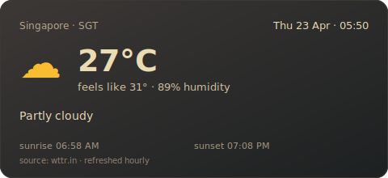

<!-- ═══════════════════════════════════════════════════════════════════ -->
<!--  ██╗  █████╗   ██████╗  ██████╗  ███╗   ██╗                          -->
<!--  ██║ ██╔══██╗ ██╔════╝ ██╔═══██╗ ████╗  ██║     this README is over- -->
<!--  ██║ ███████║ ╚█████╗  ██║   ██║ ██╔██╗ ██║     engineered on purpose -->
<!--  ██║ ██╔══██║  ╚═══██╗ ██║   ██║ ██║╚██╗██║     — jason, probably     -->
<!--  ██║ ██║  ██║ ██████╔╝ ╚██████╔╝ ██║ ╚████║                           -->
<!--  ╚═╝ ╚═╝  ╚═╝ ╚═════╝   ╚═════╝  ╚═╝  ╚═══╝                           -->
<!-- ═══════════════════════════════════════════════════════════════════ -->

<!-- ═════════════════════════════ NOW TICKER ═════════════════════════ -->

<!-- NOW:START -->
> **right now** — 😴 knocked out _(last ping: Thu 05:58 SGT)_
<!-- NOW:END -->

<!-- ═══════════════════════════════════════════════════════════════════ -->
<!--                              HERO                                   -->
<!-- ═══════════════════════════════════════════════════════════════════ -->

 

 

  

<!-- ═══════════════════════════════════════════════════════════════════ -->
<!--                             ABOUT                                   -->
<!-- ═══════════════════════════════════════════════════════════════════ -->

##  &nbsp;About Me

I'm a data scientist and aspiring indie game developer from Indonesia, currently based in Singapore. Professional aircon enjoyer, small-time food critic, and pixel art enthusiast. I spend my free time cooking dishes from various cuisines, competing in hackathons, and writing for my blog.

Despite my profile picture making me look like I run three MLMs in my sleep, I do enjoy talking to people and making new friends :)

 

<picture>
  <source media="(prefers-color-scheme: dark)" srcset="images/terminal-about.svg" />
  <source media="(prefers-color-scheme: light)" srcset="images/terminal-about.svg" />
  
</picture>

<!-- COFFEE:START -->
> ☕ **1,792** cups of coffee fueled these commits · _(lifetime count, refreshed daily)_
<!-- COFFEE:END -->

 

<!-- ═══════════════════════════════════════════════════════════════════ -->
<!--                          TECH STACK                                 -->
<!-- ═══════════════════════════════════════════════════════════════════ -->

##  &nbsp;Tech Stack

 

 

 

  

<b>&gt; ./skills.sh --animated</b> (click to animate the bars)

 

 

<!-- ═══════════════════════════════════════════════════════════════════ -->
<!--                     CHARACTER SHEET + PET                           -->
<!-- ═══════════════════════════════════════════════════════════════════ -->

##  &nbsp;Character Sheet

  

<b>&gt; ./feed_pet.sh</b> (the tamagotchi lives)

 

 
mood shifts based on days-since-last-push. feed it commits.

 

<!-- ═══════════════════════════════════════════════════════════════════ -->
<!--                          PROJECTS                                   -->
<!-- ═══════════════════════════════════════════════════════════════════ -->

##  &nbsp;Featured Projects

&nbsp;

&nbsp;

&nbsp;

 

<!-- ═══════════════════════════════════════════════════════════════════ -->
<!--                    LIVE WIDGETS (wttr, joke)                        -->
<!-- ═══════════════════════════════════════════════════════════════════ -->

##  &nbsp;Live Widgets

<table align="center" width="100%">
<tr>
<td align="center" width="50%" valign="top">
<b>SG weather right now</b>
  

 
auto-refreshed hourly from wttr.in
</td>
<td align="center" width="50%" valign="top">
<b>joke of the day</b>
  

<!-- JOKE:START -->
> 🃏 **joke of the day** — _2026-04-22_
> 
> Ransomware: the CEO's surprise pop quiz.
<!-- JOKE:END -->

 
deterministic pick from <code>data/jokes.json</code>. curated by me, blame also me.
</td>
</tr>
</table>

 

<!-- ═══════════════════════════════════════════════════════════════════ -->
<!--                   CONTRIBUTION GRAPH TRIPLE-STACK                   -->
<!-- ═══════════════════════════════════════════════════════════════════ -->

##  &nbsp;Contribution Graph — Snake, Pacman, Isometric

<picture>
  <source media="(prefers-color-scheme: dark)"  srcset="https://raw.githubusercontent.com/jasonmatthewsuhari/jasonmatthewsuhari/output/github-snake-dark.svg" />
  <source media="(prefers-color-scheme: light)" srcset="https://raw.githubusercontent.com/jasonmatthewsuhari/jasonmatthewsuhari/output/github-snake.svg" />
  
</picture>

  

<b>&gt; ./swap_mode.sh pacman</b> (click to summon pacman)

 

 
pacman chases the greens. ghosts chase the pacman. the ghosts are deadlines.

 

<b>&gt; ./view_mode.sh isometric</b> (3D skyline)

 

 

<!-- ═══════════════════════════════════════════════════════════════════ -->
<!--                          ANALYTICS                                  -->
<!-- ═══════════════════════════════════════════════════════════════════ -->

##  &nbsp;GitHub Analytics

 

  

<b>&gt; ./stats.sh --verbose</b> (trophies, activity, leetcode)

 

  

  

<!-- ═══════════════════════════════════════════════════════════════════ -->
<!--                      RECENT ACTIVITY + BLOG                         -->
<!-- ═══════════════════════════════════════════════════════════════════ -->

<b>&gt; ./recent.sh</b> (what I've been touching lately)

<!--START_SECTION:activity-->
1. 🎉 Merged PR [#25626](https://github.com/google-gemini/gemini-cli/pull/25626) in [google-gemini/gemini-cli](https://github.com/google-gemini/gemini-cli)
2. 🗣 Commented on [#25747](https://github.com/google-gemini/gemini-cli/issues/25747#issuecomment-4291567935) in [google-gemini/gemini-cli](https://github.com/google-gemini/gemini-cli)
3. 🗣 Commented on [#24399](https://github.com/google-gemini/gemini-cli/pull/24399#issuecomment-4291217223) in [google-gemini/gemini-cli](https://github.com/google-gemini/gemini-cli)
4. 🗣 Commented on [#25626](https://github.com/google-gemini/gemini-cli/pull/25626#issuecomment-4291164214) in [google-gemini/gemini-cli](https://github.com/google-gemini/gemini-cli)
5. 🗣 Commented on [#25373](https://github.com/google-gemini/gemini-cli/pull/25373#issuecomment-4290886125) in [google-gemini/gemini-cli](https://github.com/google-gemini/gemini-cli)
<!--END_SECTION:activity-->

<b>&gt; ./blog.sh</b> (latest posts from Medium)

<!-- BLOG-POST-LIST:START -->
- [The Great Blunder of “Study Techniques”](https://medium.com/@jasonmatthewsuhari/the-great-blunder-of-study-techniques-507d5f684e73?source=rss-4c7070164f1c------2) — *Mon Mar 18 2024 9:09 AM*
- [The Deadline Dilemma: How Indefinite Tasks Kill Your To-Do List](https://medium.com/@jasonmatthewsuhari/the-deadline-dilemma-how-indefinite-tasks-kill-your-to-do-list-7e25ed5af087?source=rss-4c7070164f1c------2) — *Sun Mar 17 2024 2:49 PM*<!-- BLOG-POST-LIST:END -->

 

<!-- ═══════════════════════════════════════════════════════════════════ -->
<!--                           QUOTE                                     -->
<!-- ═══════════════════════════════════════════════════════════════════ -->

*"I didn't come this far, just to come this far."*

 

<!-- ═══════════════════════════════════════════════════════════════════ -->
<!--                            FOOTER                                   -->
<!-- ═══════════════════════════════════════════════════════════════════ -->

 

<!-- 🥚 EASTER EGG: what are u doing here dawg

          ___________
         '._==_==_=_.'
         .-\:      /-.
        | (|:.     |) |
         '-|:.     |-'
           \::.    /
            '::. .'
              ) (
            _.' '._
           '-------'

     Achievement Unlocked: README Archaeologist
-->

<!-- ═══════════════════════════════════════════════════════════════════ -->
<!--  🗝️  THE EGG HUNT — 7 hidden across this profile.                    -->
<!--  egg 1 of 7: check images/.eggs/01.svg                              -->
<!--  if you found them all, DM me — you've earned a sticker.            -->
<!-- ═══════════════════════════════════════════════════════════════════ -->

🗝️ THE EGG HUNT: egg 1/7 — check images/.eggs/01.svg. there are 6 more.

