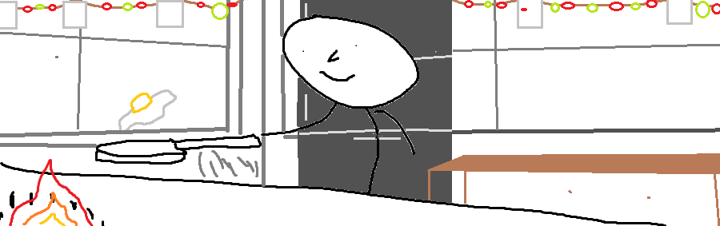

</img>

<table align="right">
 <tr><td><a href="README.md"> English</a></td></tr>
 <tr><td><a href="alt_readme/README_ID.md"> Bahasa Indonesia</a></td></tr>
 <tr><td><a href="alt_readme/README_CN.md"> 中文</a></td></tr>
 <tr><td><a href="alt_readme/README_FR.md"> Français</a></td></tr>
</table>

<h1> 🙋‍♂️ Hi there, you can call me Jason! </h1>
Lorem ipsum dolor sit amet, consectetur adipiscing elit. Donec fringilla malesuada augue. Pellentesque egestas vel enim in consequat. Nullam nunc lacus, laoreet a diam id, sollicitudin varius nunc. Nulla facilisi. Vivamus vulputate sagittis est et tempus. Duis ullamcorper ante et lorem varius, in ultricies ligula condimentum. Nulla quis scelerisque risus. In semper enim ut arcu molestie finibus. Proin dictum pellentesque risus, ac aliquam sem vestibulum eu. Maecenas in ex diam. Pellentesque et erat mauris.

---

<h1> 🎭 Beyond the monitor... </h1>
I find myself enjoying eiowhjnqurvinhjkuyeqwhniuyjvehijnuy8rvhuyijknewrkhnuy8ijvewnhqruy8ijkvhijknuy8qrwevhuijkn8yeqrwiv8hjuyewrhuyijknbvqeuwyhijknrvfiunhy8jkerwhijuy8veqrwjhu8ivuewhijkqvhijkuerhijuvnkeqi8uhy7jvye8hijqurvhijuy8eqrwhijuykneqwhj8inuyvewqriuhy8jvey8hijnu
---

<h1> 😎 Check these out. </h1>
This part will be filled with project icons sooner or later, but will be using text for now.

---

<!-- 

  

 -->
