<!-- ⚠️  STATIC TRANSLATION — the English [README.md](../README.md) has the live widgets
     (animated CRT banner, tamagotchi pet, RPG sheet, time-aware NOW ticker,
     live SG weather card, joke-of-the-day, easter-egg chain). these pages
     are snapshots and do not auto-update. -->

 

 

 

##  &nbsp;เกี่ยวกับฉัน

ผมเป็นนักวิทยาศาสตร์ข้อมูลและนักพัฒนาเกมอินดี้จากอินโดนีเซีย ปัจจุบันอาศัยอยู่ในสิงคโปร์ เป็นมือโปรด้านแอร์ นักวิจารณ์อาหารตัวน้อย และผู้หลงใหลพิกเซลอาร์ต เวลาว่างผมชอบทำอาหารหลากหลาย เข้าร่วมแฮกกาธอน และเขียนบล็อก

ถึงแม้รูปโปรไฟล์จะดูเหมือนบริหาร MLM สามตัวตอนหลับ แต่ผมชอบคุยกับคนและมีเพื่อนใหม่จริงๆ นะ :)

 

<picture>
  <source media="(prefers-color-scheme: dark)" srcset="../images/terminal-about.svg" />
  <source media="(prefers-color-scheme: light)" srcset="../images/terminal-about.svg" />
  
</picture>

  

&nbsp;
&nbsp;
&nbsp;
&nbsp;
&nbsp;

 

##  &nbsp;เทคโนโลยีที่ใช้

 

 

 

 

##  &nbsp;โปรเจกต์เด่น

&nbsp;

&nbsp;

&nbsp;

 

##  &nbsp;GitHub สถิติ

 

 

 

*"ผมไม่ได้มาไกลขนาดนี้ แค่เพื่อมาถึงแค่นี้"*

 

